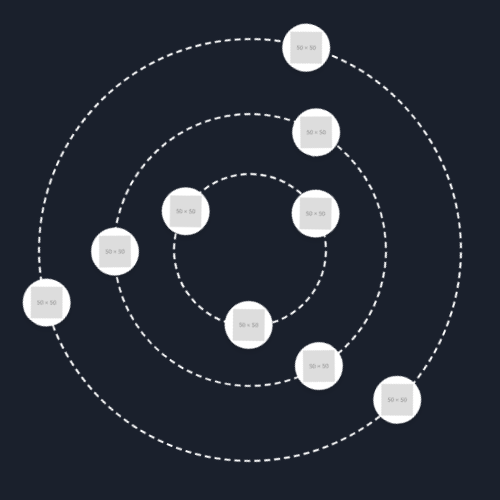

# latibro-core &#x1F30C;

Latibro (read backwards) is a lightweight JavaScript library for creating animated orbital components.



## Features

- Dynamic circular orbit animations.
- Supports multiple orbits with independent speeds.
- Fully customizable:
  - <code>v0.2.0</code> Container, Orbit and Item customization (default CSS, custom CSS classes, inline styles).
  - Orbit styles (color, thickness, etc.).
  - Element animations and spacing.
- Designed for performance and ease of use.

## Installation

```bash
npm install latibro-core
```

## Usage

#### **Basic Example**

<code>index.html</code>

```html
<!DOCTYPE html>
<html lang="en">
  <head>
    <meta charset="UTF-8" />
    <meta name="viewport" content="width=device-width, initial-scale=1.0" />
    <title>Basic Example</title>
    <script type="module" src="./config.js"></script>
  </head>

  <body>
    <div id="orbital-container"></div>
  </body>
</html>
```

<code>src/config.js</code>

```javascript
import Orbital from "latibro-core";

const container = document.getElementById("orbital-container");
const config = {
  orbits: [
    {
      items: [
        "https://placehold.co/50",
        "https://placehold.co/50",
        "https://placehold.co/50",
      ],
      speed: 10,
    },
  ],
};

new Orbital(container, config);
```

#### **Example: Default CSS rules**

<code>.orbital-container</code>

```css
.orbital-container {
  width: 500px;
  height: 500px;
  position: relative;
  overflow: hidden;
  display: flex;
  align-items: center;
  justify-content: center;
  background-color: #1a202c;
}
```

### Customization Order (CSS Priority)

The styles applied to both the container and orbits follow a specific order of priority:

1. **Default CSS** rules (built-in styles applied automatically).
2. **Custom CSS** (<code>customCss</code>) (if defined, these class styles override the defaults).
3. **Inline styles** (<code>styles</code>) (if defined, these will override both default and custom CSS styles).

## Container Customization

The <code>container</code> configuration allows you to customize the **main orbit container** using **CSS classes** or **inline styles**.

| Prop                             | Type                | Default                | Description                                                                                                                |
| -------------------------------- | ------------------- | ---------------------- | -------------------------------------------------------------------------------------------------------------------------- |
| <code>_~backgroundColor~_</code> | <code>String</code> | <code>"#1a202c"</code> | _<code>deprecated</code>_ The background color of the orbital container (Use <code>styles.backgroundColor</code> instead). |
| <code>customCss</code>           | <code>String</code> | <code>""</code>        | <code>v0.2.0</code> Custom CSS classes applied to the container.                                                           |
| <code>styles</code>              | <code>Object</code> | <code>{}</code>        | <code>v0.2.0</code> Inline styles applied to the container .                                                               |

## Deprecated Properties

These properties are deprecated and will be removed in a future version:

| Property          | Alternative                        |
| ----------------- | ---------------------------------- |
| `backgroundColor` | `container.styles.backgroundColor` |

**Warning:** Using these properties will trigger a console warning.

## Examples

#### **Example: Using Custom CSS**

```javascript
const config = {
  container: {
    customCss: "custom-container",
  },
};
```

#### **Example: Using Inline Styles**

```javascript
const config = {
  container: {
    styles: {
      width: "500px",
      height: "500px",
      backgroundColor: "#ff5733",
    },
  },
};
```

## Orbit Customization

Each orbit can be customized in the same way as the container, using:

1. **Default CSS** rules (applied automatically to all orbits).
2. **Custom CSS** (<code>customCss</code>) (if provided, this class is added on top of the default styles).
3. **Inline styles** (<code>styles</code>) (applied last and override all previous styles).

### Orbits Global Properties

| Prop                      | Type                | Default         | Description                                                          |
| ------------------------- | ------------------- | --------------- | -------------------------------------------------------------------- |
| <code>orbits</code>       | <code>Array</code>  | <code>[]</code> | List of orbit objects. Each orbit defines items and styling options. |
| <code>orbitSpacing</code> | <code>Number</code> | <code>55</code> | The spacing (value) between consecutive orbits.                      |

#### **Example: Custom Orbits spacing**

```javascript
const config = {
  orbits: [
    {
      items: ["https://placehold.co/50"],
    },
    {
      items: ["https://placehold.co/50"],
    },
    {
      items: ["https://placehold.co/50"],
    },
  ],
  orbitSpacing: 200,
};
```

### Orbit <code>Object</code> Properties

| Prop                         | Type                | Default               | Description                                                                                                        |
| ---------------------------- | ------------------- | --------------------- | ------------------------------------------------------------------------------------------------------------------ |
| <code>items</code>           | <code>Array</code>  | <code>[]</code>       | Array of image URLs or content to display as orbiting items.                                                       |
| <code>customRadius</code>    | <code>Number</code> | <code>75</code>       | Custom radius (value) for the orbit.                                                                               |
| <code>_~borderColor~_</code> | <code>String</code> | <code>"white"</code>  | _<code>deprecated</code>_ The color of the orbit border (Use <code>styles.borderColor</code> instead).             |
| <code>_~borderStyle~_</code> | <code>String</code> | <code>"dashed"</code> | _<code>deprecated</code>_ The style of the orbit border (Use <code>styles.borderStyle</code> instead).             |
| <code>_~borderWidth~_</code> | <code>Number</code> | <code>2</code>        | _<code>deprecated</code>_ The width of the orbit border (in pixels) (Use <code>styles.borderWidth</code> instead). |
| <code>customCss</code>       | <code>String</code> | <code>null</code>     | Custom CSS classes to apply to the orbit element.                                                                  |
| <code>styles</code>          | <code>Object</code> | <code>{}</code>       | Inline styles (applied last, override everything).                                                                 |
| <code>speed</code>           | <code>Number</code> | <code>10</code>       | Speed of rotation (in seconds for one full rotation).                                                              |

## Deprecated Properties

These properties are deprecated and will be removed in a future version:

| Property      | Alternative                |
| ------------- | -------------------------- |
| `borderColor` | `orbit.styles.borderColor` |
| `borderWidth` | `orbit.styles.borderWidth` |
| `borderStyle` | `orbit.styles.borderStyle` |

**Warning:** Using these properties will trigger a console warning.

## Examples

#### **Example: Custom CSS for Orbits**

```javascript
const config = {
  orbits: [
    {
      items: ["https://placehold.co/50"],
      customCss: "custom-orbit",
    },
  ],
};
```

#### **Example: Custom Inline Styles for Orbits**

```javascript
const config = {
  orbits: [
    {
      items: ["https://placehold.co/50"],
      styles: {
        border: "3px solid red",
        width: "200px",
        height: "200px",
      },
    },
  ],
};
```

#### **Example: Default CSS rules**

<code>.orbit-0</code>

```css
.orbit-0 {
  position: absolute;
  width: 150px;
  height: 150px;
  border-radius: 50%;
  border: 2px dashed white;
  animation: 10s linear 0s infinite normal none running orbit-0-rotation;
}
```

Built-in CSS class (<code>.orbit-<0..n></code>) are applied automatically for each orbit.
Some CSS props like <code>width</code>, <code>height</code> or <code>animation</code> are automatically calculated, based on the number of generated orbits.

## Items Customization

Each item (attached to orbit) can be customized in the same way as the container, using:

1. **Default CSS** rules (applied automatically to all items).
2. **Custom CSS** (<code>customCss</code>) (if provided, this class is added on top of the default styles).
3. **Inline styles** (<code>styles</code>) (applied last and override all previous styles).

### Item <code>Object</code> Properties

Each item inside an orbit can be configured using either a **string** (image URL) or an **object** with more customization options.

| Prop        | Type     | Default | Description                                        |
| ----------- | -------- | ------- | -------------------------------------------------- |
| `src`       | `string` | `""`    | Image URL of the orbiting item.                    |
| `customCss` | `string` | `null`  | Custom CSS classes applied to the item.            |
| `styles`    | `Object` | `{}`    | Inline styles (applied last, override everything). |

## Examples

#### **Example: Using Image URLs (string array)**

```javascript
const config = {
  orbits: [
    {
      items: ["https://placehold.co/50", "https://placehold.co/50"],
    },
  ],
};
```

#### **Example: Using Custom Item Objects**

```javascript
const config = {
  orbits: [
    {
      items: [
        {
          src: "https://placehold.co/50",
          customCss: "custom-item",
          styles: {
            border: "2px solid red",
            width: "40px",
            height: "40px",
          },
        },
      ],
    },
  ],
};
```

#### **Example: Default CSS rules**

<code>.orbit-wrapper-0-0</code>

```css
.orbit-wrapper-0-0 {
  position: absolute;
  offset-path: circle(75px at 50% 50%);
  offset-distance: 0%;
  offset-rotate: 0deg;
  animation: orbit-wrapper-0-0-anim 10s linear infinite normal;
}
```

<code>.orbit-item-0-0</code>

```css
.orbit-item-0-0 {
  width: 48px;
  height: 48px;
  border-radius: 50%;
  background: white;
  display: flex;
  align-items: center;
  justify-content: center;
  box-shadow: 0 4px 6px -1px rgb(0 0 0 / 0.1), 0 2px 4px -2px rgb(0 0 0 / 0.1);
}
```

<code>.orbit-img-0-0</code>

```css
.orbit-img-0-0 {
  width: 32px;
  height: 32px;
  object-fit: contain;
}
```

#### Example: Default HTML structure

```html
<div id="orbital-container" class="orbital-container">
  <div class="orbit orbit-0">
    <div class="orbit-wrapper orbit-wrapper-0-0">
      <div class="orbit-item orbit-item-0-0">
        
      </div>
    </div>
  </div>
</div>
```

Check the <code>/examples/</code> folder for various demos:

- Basic (<code>basic/</code>). Simple orbit with default parameters.
- Container CSS (<code>container-css/</code>). Example showing how to style the container.
- Orbit CSS (<code>orbit-css/</code>). Example showing how to style orbits.
- Multiple Orbits (<code>multi-orbits/</code>). Example with independent configurations.

## Development

Run the development server:

```bash
npm run dev
```

Build the library for production:

```bash
npm run build
```

## License

This project is licensed under the [MIT License](https://github.com/hramasimpaniry/latibro-core/blob/main/LICENSE).

---
